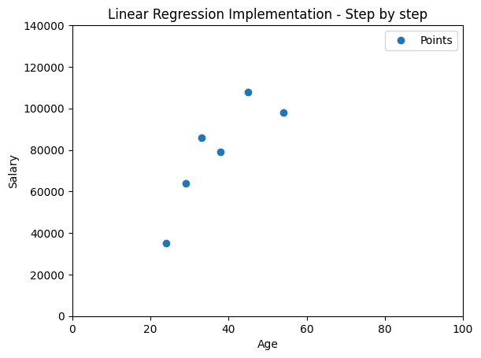
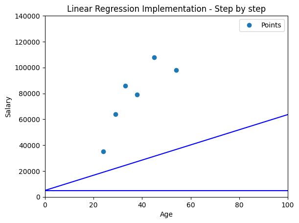

# Linear Regression: Step-by-step implementation


## 1. Basic plot
This is a basic program which plots a set of (age, salary) data in 2D space using Matplotlib.

```python {highlight=10}
import matplotlib.pyplot as plt
import numpy as np

# Define the plot area and set the range
f, ax = plt.subplots() 
ax.set_xlim(left=0, right=100)
ax.set_ylim(bottom=0, top=140000)

# Data points
age = [24, 38, 45, 29, 54, 33]
salary = [35000, 79000, 108000, 64000, 98000, 86000]

# Plotting points
plt.plot(age, salary, 'o', label='Points')  # 'o' specifies circular markers
plt.title("Linear Regression Implementation - Step by step")
plt.xlabel("Age")
plt.ylabel("Salary")
plt.legend()

plt.show()
```


## 2. Initialization step
Set initial values for **slope m** and **y-intercept c** and draw a line.

```python
import matplotlib.pyplot as plt
import numpy as np

# Data points
...

# Define the plot area and set the range
...

# Initialize slope & y-intercept and draw a line
m=0
c=5000
ax.axline((0, c), slope=m, color='blue', label=f'y = {m}x + {c}')

plt.show()
```


## 3. Defining error/loss function
Determine the error with respect to the line using Sum of Squares Error.

```python
import matplotlib.pyplot as plt
import numpy as np

# Error function definition
def error(m, c, x, y):
    totalError = 0
    for i in range(0, len(x)):
        totalError += (y[i] - (m*x[i] + c))**2
    return totalError/float(len(x))

# Data points
...

# Define the plot area and set the range
...

# Initialize slope & y-intercept and draw a line
...

# Call error function to compute the error
print("SSE for slope ", m, " and ", c ," is ", error(m, c, age, salary))

plt.show()
```
**Output**:
*SSE for slope  0  and  5000  is  5946000000.0*

## 4. Defining the step gradient function
Compute the step gradient for m and c.

```python
import matplotlib.pyplot as plt
import numpy as np

# Error function definition
...

# Step gradient function definition
def step_gradient(m_current, c_current, x, y, learning_rate):
  for i in range(0, len(x)):
    m_gradient = 0
    c_gradient = 0
    N = len(age)
    for i in range(0, len(x)):
        m_gradient += -(2/N)* (y[i] - (m_current * x[i] + c_current)) * x[i]
        c_gradient += -(2/N)* (y[i] - (m_current * x[i] + c_current))
    new_m = m_current - (learning_rate * m_gradient)
    new_c = c_current - (learning_rate * c_gradient)
    return [new_m, new_c]

# Data points
...

# Define the plot area and set the range
...

# Initialize slope & y-intercept and draw a line
...

# Call error function to compute the error
...

# Call step gradient and compute the new m and c and plot the line
learning_rate = 0.0001
m, c = step_gradient(m, c, age, salary, learning_rate)
ax.axline((0, c), slope=m, color='blue', label=f'y = {m}x + {c}')
print("SSE for slope ", m, " and ", c ," is ", error(m, c, age, salary))

plt.show()
```
SSE for slope  0  and  5000  is  5946000000.0
SSE for slope  585.7666666666667  and  5014.666666666667  is  3021712330.0479627


## 5. Determine the best fit by gradient descent
Iterate repeatedly to determine the new values of m and c and draw the lines. You can note that the gap reduces as you go closer.

```python
import matplotlib.pyplot as plt
import numpy as np

# Error function definition
...

# Step gradient function definition
...

# Data points
...

# Define the plot area and set the range
...

# Initialize slope & y-intercept and draw a line
...

# Call error function to compute the error
...

# Call step gradient and compute the new m and c and plot the line
learning_rate = 0.0001
num_iterations = 1000
for i in range(0, num_iterations):
  m, c = step_gradient(m, c, age, salary, learning_rate)
  ax.axline((0, c), slope=m, color='blue', label=f'y = {m}x + {c}')
  print("SSE for slope ", m, " and ", c ," is ", error(m, c, age, salary))

plt.show()
```
