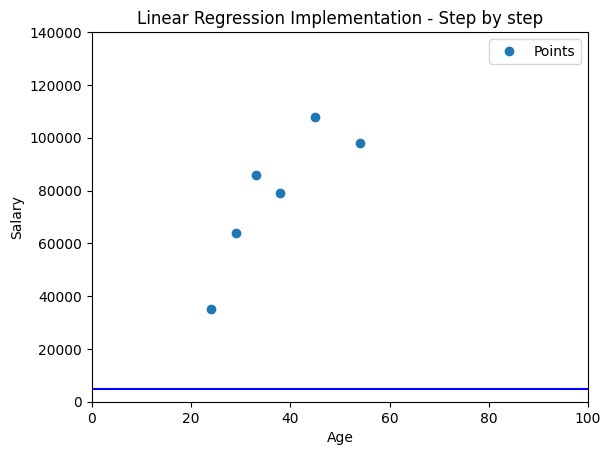

# Linear Regression: Step-by-step implementation


## 1. Basic plot
This is a basic program which plots a set of (age, salary) data in 2D space using Matplotlib.

```python
import matplotlib.pyplot as plt
import numpy as np

# Data points
age = [24, 38, 45, 29, 54, 33]
salary = [35000, 79000, 108000, 64000, 98000, 86000]

# Define the plot area and set the range
f, ax = plt.subplots() 
ax.set_xlim(left=0, right=100)             # Set x-axis range
ax.set_ylim(bottom=0, top=140000)          # Set y-axis range

# Plotting points
plt.plot(age, salary, 'o', label='Points')  # 'o' specifies circular markers
plt.title("Linear Regression Implementation - Step by step")
plt.xlabel("Age")
plt.ylabel("Salary")
plt.legend()

plt.show()
```


## 2. Initialization step
Set initial values for **slope m** and **y-intercept c** and draw a line.

```python
import matplotlib.pyplot as plt
import numpy as np

# Data points
age = [24, 38, 45, 29, 54, 33]
salary = [35000, 79000, 108000, 64000, 98000, 86000]

# Define the plot area and set the range
f, ax = plt.subplots() 
ax.set_xlim(left=0, right=100) 
ax.set_ylim(bottom=0, top=140000) 
# Plotting points
plt.plot(age, salary, 'o', label='Points')  # 'o' specifies circular markers
plt.title("Linear Regression Implementation - Step by step")
plt.xlabel("Age")
plt.ylabel("Salary")
plt.legend()

m=0
c=5000
ax.axline((0, c), slope=m, color='blue', label=f'y = {m}x + {c}')

plt.show()
```


## 3. Defining error/loss function
Determine the error with respect to the line using MSE.


## 4. Defining the step function

## 5. Gradient descent

